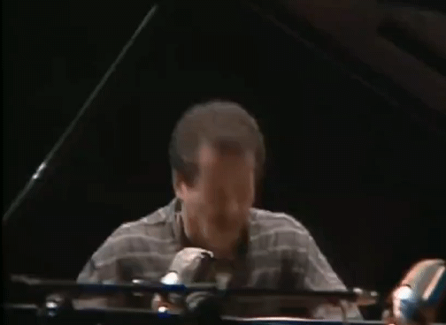
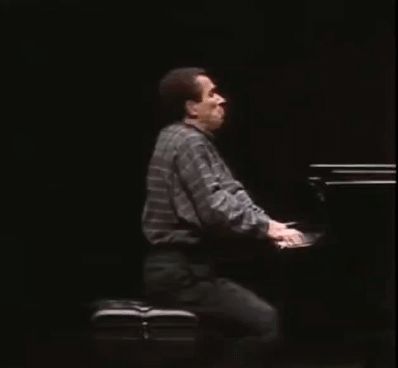

# Headhunter: A Reprogrammable Head-tracking Midi Controller

---

## Gefei Tan

---

### Introduction
Headhunter is a head-tracking midi controller. It allows user to use their head to control a midi-compatible instrument. 

Headhunter uses sensors in smartphones to do head tracking. It translates these data to corresponding MIDI messages using Max. User can easily customize Headhunter by remapping head movements to different midi messages.

---

### Inspiration
My inspiration for Headhunter comes from Keith Jarrett, one of my favorite jazz pianists. (Yeah, I know the name Headhunter might imply Herbie, but the name Headhunter is simply a puntastic dad joke.)

Besides his constant and notorious moaning, Mr. Jarrett also loves to make these dramatic head movements when playing the piano.

People found these movements to be really distracting because they have nothing to do with the music. This makes me think: what if these seemingly redundant movements could control some aspect of the sound? What if they become part of the musical performance? This way, the audience would no longer find these movements to be distracting but find them to be engaging because now they would receive auditory feedback when they see these movements. This would also give the keyboard player more degrees of freedom, and allows them to do things that are not possible before: bending notes while playing two-hand chords, and changing parameters without having to touch any knob or sliders.

---
### Process
After my initial idea, my plan is to make a proof of concept first, and if it works, I will continue to commit to this idea and bring this instrument to life.

First, I did some research on head tracking and found this open-source software called opentrack. It accepts a variety of head tracking input, which includes smartphones, so I (as well as other broke musicians who might be interested in this instrument) don't have to pay for a dedicated head tracking headset.

Next, I tried to figure out how to convert the yaw-pitch-row data from opentrack into something max could recognize. After some research, I decided to use the built-in virtual joystick output protocol, which would encode the head tracking information to a virtual joystick. Then, Max could deal with the virtual joystick input.

The final step is to figure out how to properly map three virtual joystick inputs to midi messages. These inputs are integers from 0-65535, and midi note bend messages and continuous control messages are all values from 0-127. A simple linear mapping wouldn't do because, first, it is really hard to move one's head to reach both ends of an axis, and if control to be too sensitive, it will be hard to stay in tune. These kind of problems require lots of trial-and-error parameter adjustment. After lots of experiments, I wrote several dedicated javascript objects in Max to handle these rather complicated mapping rule sets.

---
### Future Work

Currently, if one wants to change some parameters in the mapping rule sets, they have to edit the javascript code. In the future, I would like to make a slider or something that would make the parameter tuning process easier.

Also, I think it would be great if all these separate software used can be made into a single executable file. This could be difficult but important because this would make Headhunter much more user-friendly and more like a product.

---
### Video Demo

In this demo, I am playing a Rhodes and an ARP Solina string ensemble. The volume of the ARP Solina is set to 0 at the beginning. 

I mapped the yaw axis to the pitch bend. So you will hear this vibrato/out-of-tune effect when I turn my head left and right.

I mapped the pitch axis to the volume of the ARP Solina, so you can hear its sound fading in and out as I look up and down.

<iframe width="640" height="480"
src="https://www.youtube.com/embed/a7rpF8U1QdA">
</iframe>

###### Music written by [me](https://open.spotify.com/playlist/62j0qdzoFFmlWArG9rjw5y?si=134dd3bfddf4407d)
---
### How to Setup Headhunter
#### The following method only works in Windows. The main problem with MacOS is that virtual joystick support on Mac is really complicated. It might require low-level actions like compiling drivers from source and installing kernel extensions. If you could find a way to make virtual joystick work, Headhunter could potentially work on MacOS.

1. Install opentrack, Max, Vjoy, and loopMIDI on your PC following the links provided in the Credit and Download section below.
2. Follow [this link](https://github.com/opentrack/opentrack/wiki/Smartphone-Headtracking) to setup and connect your smartphone to opentrack. Make sure opentrack responds to your smartphone before proceeding to the next step.
3. Change the output protocol in opentrack to "Virtual Joystick".
4. Create a new midi channel in loopMIDI. This is for connecting Max to your instrument.
5. Download the Max patch and js files [here](media/headhunter_max_patch.zip). Set all the `ctlout` and `bendout` objects to the midi channel you created in step 5. Select `vjoy device` as your input, and click `poll 10` to start the Max patch.
6. Set the channel you created in step 5 as the input of your VST. Or simply select "All" as your input.
7. Start opentrack and your smartphone as you've done in step 2. You should be able to see numbers changing in your Max patch.
8. Figure out your "zero position" and reset the tracking in opentrack.
9. Now you can start to use Headhunter!

---
### Credit and Download

[Download The Headhunter Max Patch and Javascript Files](media/headhunter_max_patch.zip)

#### Software Used in the Project:

[OpenTrack](https://github.com/opentrack/opentrack) 

[Max](https://cycling74.com/products/max</a>)

[Vjoy](https://sourceforge.net/projects/vjoystick/)

[loopMIDI](https://www.tobias-erichsen.de/software/loopmidi.html)

#### Keith Jarrett Gifs are from [Keith Jarrett solo concert - Tokyo, 1984](https://www.youtube.com/watch?v=KPgEoDt_Duc)
